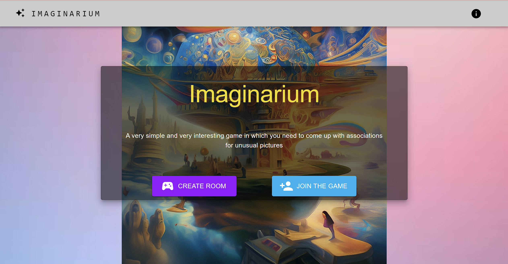

# Imaginarium (frontend)

It is impossible to play Imaginarium online for free and without registration. The project provides an opportunity to play a board game while at a distance.

Frontend development is described here.
Backend development is presented at the link https://github.com/Pololoshka/imaginarium_backend

Project development status: in development.

## Usage

The project is still in development.

## Development

The project is written in React.

### Starting the Development server
***
Install dependencies using the command:

```
npm i
```

To start the server, run the command:

```
npm start
```
### Implementing requests to the server
***

#### Axios
***

Axios is used to interact with the server in order to authorize the user, as well as verify data before starting the game.

The instance code is shown below:

```javascript
const AxiosInstance = axios.create({
  baseURL: baseUrl,
  timeout: 5000,
  headers: {
    "Content-Type": "application/json",
    accept: "application/json",
  },
});

AxiosInstance.interceptors.request.use((config) => {
  config.headers.Authorization = `Token ${localStorage.getItem(
    "imaginariumUserToken"
  )}`;
  return config;
});

```


#### WebSockets
***

Interaction between users during the game is carried out using websockets.

```javascript
function connect() {
    var socket = new WebSocket(
      `ws://${baseHost}/ws/rooms/${roomCode}/?authorization=${localStorage.getItem(
        "imaginariumUserToken"
      )}`
    );

    socket.onmessage = async function (event) {
      const data = JSON.parse(event.data);
      if (data.type === "GameError") {
        return;
      }
      setRoom(JSON.parse(event.data).room);
    };
    return socket;
  }

  const submission = async () => {
    socket.send(
      JSON.stringify({
        message: { player_name: playerName },
        type: "update_player_name",
      })
    );
  };

```

### Design
***

The web application was designed using the Material UI




## To do

:white_check_mark: Building the project architecture: React.

:white_check_mark: Establishing communication with the backend using Axios.

:black_square_button: Organizing requests using WebSockets.

:black_square_button: Development and implementation of a web application interface using Materil UI.

:black_square_button: Run app in Docker using Docker Compose.


## The project team
[Sokolova Polina — Python developer](https://github.com/Pololoshka)
